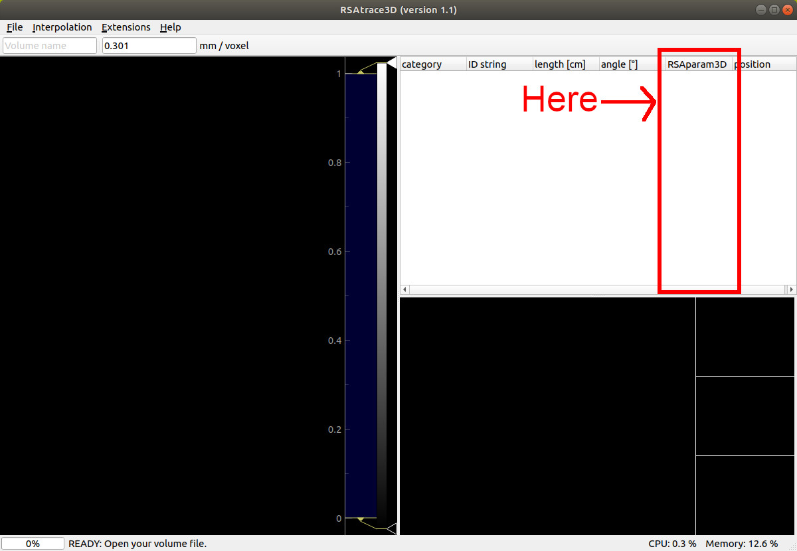
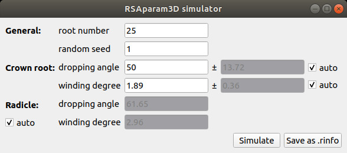
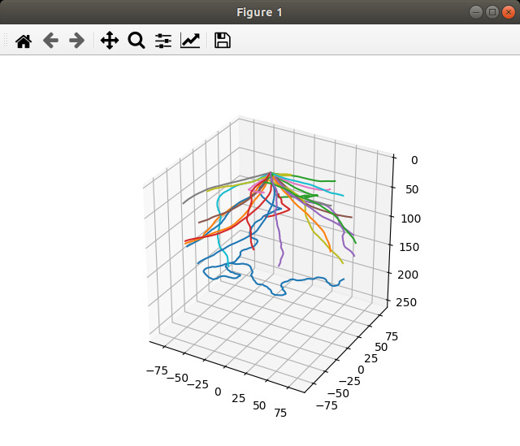

# RSAparam3D: A module of RSAtrace3D, an RSA vectorization software, for 3D RSA phenotyping

RSAparam3D is a software for RSA phenotyping of rice. RSAparam3D calculate 3D RSA traits by dividing 3D vector data into two sets of 2D vector data for horizontal and vertical components. This software works as an additional module for RSAtrace3D, which automatically calculates the RSA parameter when RSA vectorization is performed in RSAtrace3D.

## Installation

### A Backbone Software RSAtrace3D

Clone RSAtrace3D repository if it is not already cloned:

    $ git clone https://github.com/st707311g/RSAtrace3D.git

For detailed installation instructions, please refer to [here](https://github.com/st707311g/RSAtrace3D) and make sure you have installed it correctly.

### RSAparam3D

Move into the `mod` directory in the RSAtrace3D root directory.

    $ cd RSAtrace3D/mod

Clone RSAparam3D repository.

    $ git clone https://github.com/st707311g/RSAparam3D.git

Move back to the the RSAtrace3D root directory.

    $ cd .. 

Make sure you have installed RSAparam3D correctly.

    $ python list_modules.py | grep RSAparam3D
    RootTraitBackbone, <class 'mod.RSAparam3D.RSAparam3D.Root_RSAparam3D'>
    RSATraitBackbone, <class 'mod.RSAparam3D.RSAparam3D.RSA_RSAparam3D'>
    ExtensionBackbone, <class 'mod.RSAparam3D.RSAparam3D_simulatior.ExtensionRSAparam3D'>

You will find three modules, namely `Root_RSAparam3D`, `RSA_RSAparam3D`, and `ExtensionRSAparam3D`.

## How to use

Run RSAtrace3D:

    $ python .

If it was installed successfully, the treeview will list the results of RSAparam3D.

 

### Simulator

Using RSAparam3D parameters, RSA could be simulated: the simulator could be opended using `Extensions` -> `RSAparam3D simulator`.
RSA traits are calculated in the summary window that could be opened using Extensions -> RSA summary menu. 

After entering the parameters, press the `Simulate` button to simulate RSA. 

 

RSA vector data can be saved by pressing the `Save as .rinfo` button.

## Citation

We are currently submitting a paper on this software. You are free to use this software according to the license, but do not publish the results of using this software before our submitting paper has been accepted and published. 

## Licence

NARO NON-COMMERCIAL LICENSE AGREEMENT Version 1.0

This license is for 'Non-Commercial' use of software for RSAparam3D

* Scientific use of RSAparam3D is permitted free of charge.
* Modification of RSAparam3D is only permitted to the person of downloaded and his/her colleagues.
* The National Agriculture and Food Research Organization (hereinafter referred to as NARO) does not guarantee that defects, errors or malfunction will not occur with respect to RSAparam3D.
* NARO shall not be responsible or liable for any damage or loss caused or be alleged to be caused, directly or indirectly, by the download and use of RSAparam3D.
* NARO shall not be obligated to correct or repair the program regardless of the extent, even if there are any defects of malfunctions in RSAparam3D.
* The copyright and all other rights of RSAparam3D belong to NARO.
* Selling, renting, re-use of license, or use for business purposes etc. of RSAparam3D shall not be allowed. For commercial use, license of commercial use is required. Inquiries for such commercial license are directed to NARO.
* The RSAparam3D may be changed, or the distribution maybe canceled without advance notification.
* In case the result obtained using RSAparam3D in used for publication in academic journals etc., please refer the publication of RSAparam3D and/or acknowledge the use of RSAparam3D in the publication.

Copyright (C) 2021 National Agriculture and Food Research Organization. All rights reserved.

## Project homepage
https://rootomics.dna.affrc.go.jp/en/
